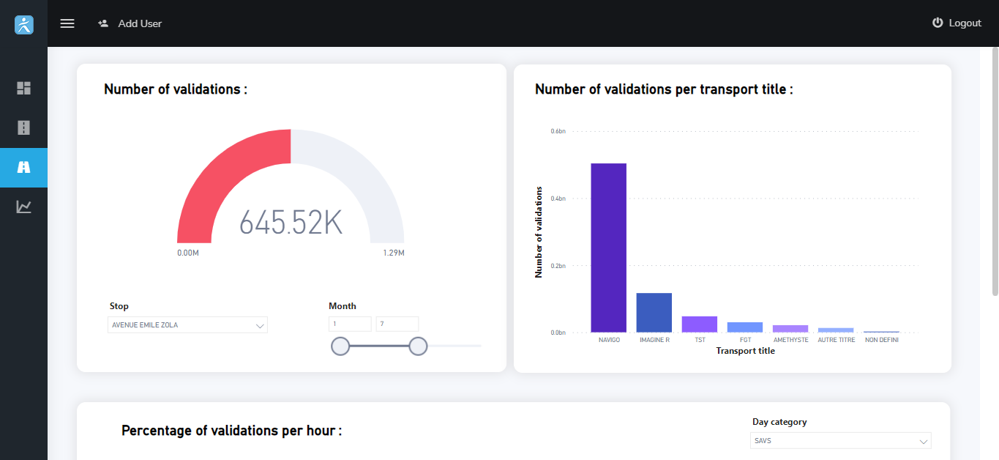

# Data Engineering Project

A Django application that provides a detailed description of "Île-de-France Mobilités" (Paris region public transport establishment) data through an interactive Microsoft Power BI dashboard as well as powerful predictions on some of the transportation data using appropriate machine learning algorithms.

### Login interface

### Home page

 Surface            |  Railroad
:-------------------------:|:-------------------------:
  |  

### Prediction interface

This interface in available only for client users where they can generate predictions based on three informations: time, day category and trafic.

### Add user interface
